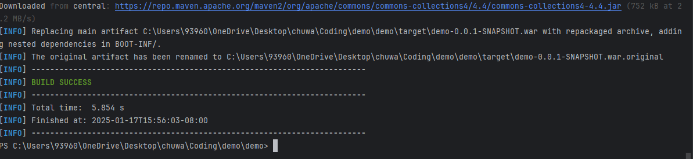
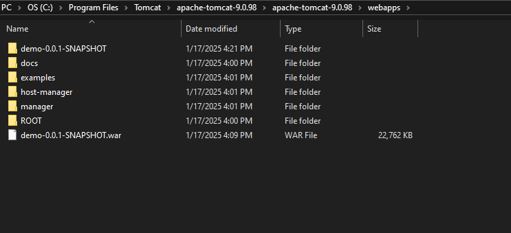
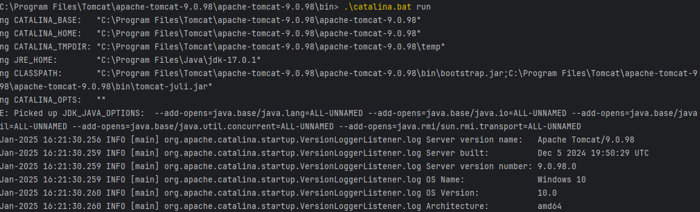

1. It is thread-safe because it uses a synchronized block internally.
   public static void main(String[] args) {
   ExecutorService executorService = Executors.newFixedThreadPool(5);

        for (int i = 0; i < 10; i++) {
            executorService.submit(() -> {
                for (int j = 0; j < 5; j++) {
                    System.out.print(Thread.currentThread().getName() + " ");
                }
            });
        }

        executorService.shutdown();
   }
    In this example, the interleaved output shows that multiple threads can produce mixed, inconsistent sequences of output.  
2. 
    Why not System.out.print: 
        1. It writes directly to the console, which is slow compared to optimized loggers. 
        2. it does not provide logging levels
    Why loggers:
        1. Configurable logging levels and outputs
        2. advanced logging libraries manage thread-safety efficiently. 
3. Why not System.out.print:
    it lacks structured logging, making it difficult to filter and analyze logs in production. 
    It cannot integrate with monitoring systems like Elastic Stack or Splunk. 
4. Level:
   TRACE: Most detailed information, mainly for debugging.
   DEBUG: Debugging information.
   INFO: General application flow messages.
   WARN: Potential issues that do not halt the application.
   ERROR: Severe issues causing application failure.

Create War File:

Deploy in tomcat:

Start tomcat:

