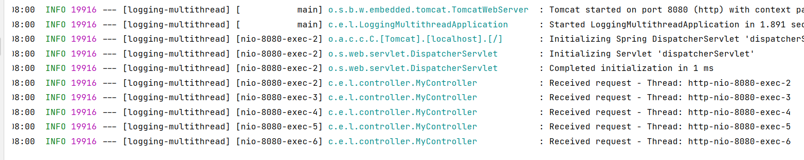
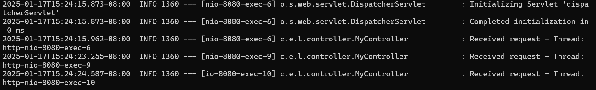
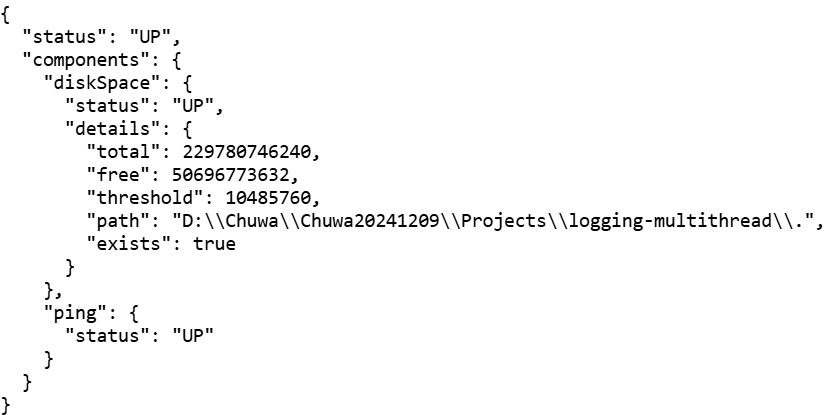
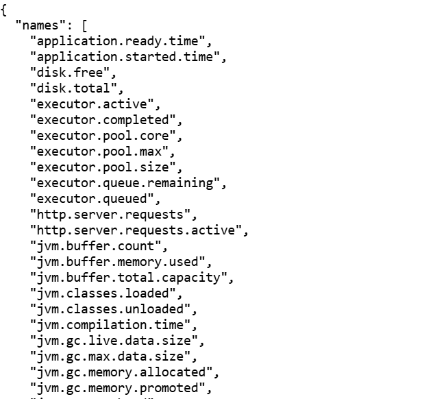
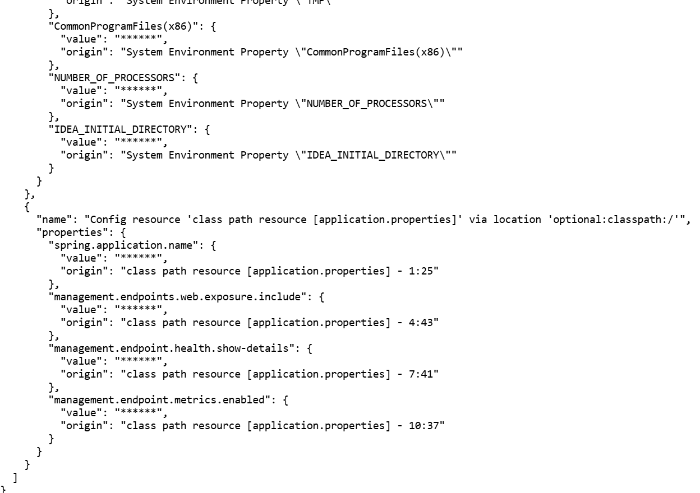

1. Is System.out.print thread safe?
   Write code using thread pool and multi-thread to answer this question.  

``` java
//Yes. It uses InternalLock and synchronized block to ensure thread safe
private void write(String s) {
    try {
        if (lock != null) {
            lock.lock();
            try {
                implWrite(s);
            } finally {
                lock.unlock();
            }
        } else {
            synchronized (this) {
                implWrite(s);
            }
        }
    }
    catch (InterruptedIOException x) {
        Thread.currentThread().interrupt();
    }
    catch (IOException x) {
        trouble = true;
    }
}

//thread pool
ExecutorService executor = Executors.newFixedThreadPool(5);
Runnable task = () -> {
    for (int i = 0; i < 5; i++) {
        System.out.print(Thread.currentThread().getName() + " \n");
    }
};
for (int i = 0; i < 5; i++) {
    executor.execute(task);
}
executor.shutdown();
```

2. Why do we NOT use System.out.print for logging in Spring? Why do we use loggers such as Log4j?  

```
System.out.print is not flexible, lacks support for different log levels, and doesn't offer features like file output, formatting, or log rotation.
Loggers such as Log4j provide configurable logging levels, better performance, and support for outputting logs to multiple destinations.
```

3. If System.out.print is thread-safe, is there any other reason why we dislike it?  

```
Yes, it's not suitable for production environments because:
It lacks features like log levels, filtering, and output control.
It can cause performance issues due to the console I/O being slower.
```

4. Explain slf4j logging levels, and what is included in slf4j logs.  

```
SLF4J (Simple Logging Facade for Java) supports the following logging levels:
TRACE: Fine-grained debug information, typically only meaningful to developers.
DEBUG: Detailed information on the flow through the system.
INFO: Runtime events (startup/shutdown).
WARN: Potentially harmful situations.
ERROR: Error events that might still allow the application to continue running.

 2025-01-17 13:46:00 [main] INFO com.example.MyClass - Application started successfully.
 1. 2025-01-17 13:46:00: Timestamp.
 2. [main]: Thread name.
 3. INFO: Log level.
 4. com.example.MyClass: Logger name / class name.
 5. Application started successfully: Message.
```

5. Write a Spring boot Rest application (using Spring Web starter on ) from Scratch, prove it is a multithreaded application by nature (without explicit configuration) according to logs.  



6. For your application in 5, make packaging type to war , deploy it to an external tomcat server,
   document how to deploy it, upload screenshot of each steps 



```
0. spring boot 3 + external Tomcat 10 + java 17
1. provide a SpringBootServletInitializer subclass and override its configure method.
2. modify pom.xml to change the packaging to war
3. mark the embedded servlet container dependency as being provided
4. run mvn clean package, copy the generated war file into [tomcat-home]/webapps/
5. run [tomcat-home]/bin/startup.bat
```

7. For your application in 5, write a global exception handler to render java exceptions to corresponding http statuses, explain your code with comments.  

```
see Projects/logging-multithread
```

8. demo spring actuator, which is a built-in module of your application.

   http://localhost:8080/actuator/health



​		http://localhost:8080/actuator/metrics




​		http://localhost:8080/actuator/env

