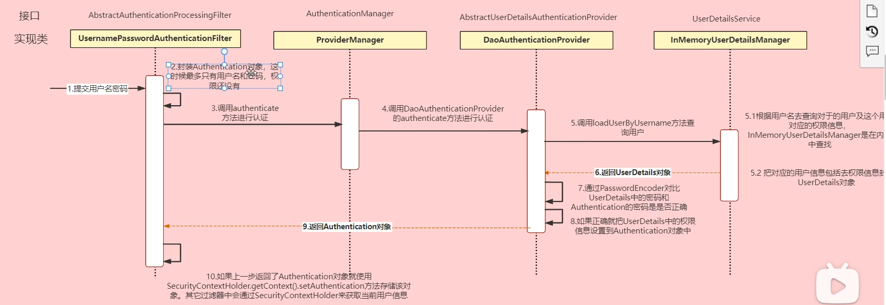

\2. Explain TLS, PKI, certificate, public key, private key, and signature  

```
TLS (Transport Layer Security): Encrypts communication over networks.
PKI (Public Key Infrastructure): A framework managing digital certificates and encryption.
Certificate: A digital document issued by a Certificate Authority (CA) that binds a public key to an entity.
Public Key: Used for encryption & verifying signatures.
Private Key: Used for decryption & signing.
Signature: A cryptographic proof ensuring integrity and authenticity of data.
```

\4. list all http status codes that related to authentication and authorization failures.  

```
401 (Unauthorized): Invalid credentials or missing authentication.
403 (Forbidden): User authenticated but lacks permission.
419 (Authentication Timeout): Session expired.
```

\5. Compare authentication and authorization? Name and explain important components in Spring
security that undertake authentication and authorization  

```
Authentication: Verifies user identity (e.g., username/password, JWT).
Authorization: Grants access based on roles/permissions.

AuthenticationManager: Authenticates users.
UserDetailsService: Loads user details from DB.
GrantedAuthority: Defines user roles.
SecurityContext: Stores authentication info for requests.
```

\6. Explain HTTP Session?  

```
a server-side storage mechanism that holds user data (login info) across multiple requests.
```

\7. Explain Cookie?  

```
a small piece of data stored on the client’s browser for tracking and authentication.
```

\8. Compare Session and Cookie?  

```
Session: Server-side, Can expire after inactivity, More secure (server-controlled), No limit (depends on server memory)
Cookie: Client-side, Has a fixed expiry, Less secure (stored in browser), 4KB limit
```

\10. How do we use session and cookie to keep user information across the the application?

```
Session: Stores user info on the server, identified by a session ID stored in a cookie (JSESSIONID).
Cookie: Stores small user info on the client-side, sent with every request.
```

\11. What is the spring security filter?

```
A chain of filters that intercepts HTTP requests to handle authentication and authorization.

UsernamePasswordAuthenticationFilter – Handles login.
BasicAuthenticationFilter – Processes HTTP Basic Auth.
BearerTokenAuthenticationFilter – Extracts JWT tokens.
SecurityContextPersistenceFilter – Manages security context.
```

\12. Explain bearer token and how JWT works.

```
A token sent in the Authorization: Bearer <token> header for authentication.

JWT has three parts: 
Header – Token type & algorithm.
Payload – User claims/data (userId).
Signature – Ensures token integrity (signed with a secret key).

JWT work process:
1. client sends a username & password to the server.
2. Spring Security verifies credentials using UserDetailsService & AuthenticationProvider. If valid, the server generates a JWT.
The server creates a JWT with:
Header: { "alg": "HS256", "typ": "JWT" }
Payload (claims): { "sub": "user1", "role": "USER", "exp": 1712345678 }
Signature: HMACSHA256(base64(header) + "." + base64(payload), secretKey)
3. The JWT is sent to the client.
4. The client stores the JWT (localStorage/HttpOnly Cookie).
5. On each request, the client sends the token in the Authorization header:
```

\13. Explain how do we store sensitive user information such as password and credit card number in DB?

```
Passwords: Store hashed & salted using BCrypt, PBKDF2, or Argon2.
Credit Card Numbers: Store encrypted using AES or RSA. For compliance, follow PCI-DSS standards.
Use environment variables for encryption keys.
```

\14. Compare UserDetailService, AuthenticationProvider, AuthenticationManager, AuthenticationFilter?  

```
UserDetailsService: Loads user details from DB for authentication.
AuthenticationProvider: Validates credentials (password check).
AuthenticationManager: Delegates authentication to one or more AuthenticationProviders.
AuthenticationFilter: Extracts credentials (JWT, username/password) from request and triggers authentication.

Filter -> Manager -> Provider -> Service -> DB
Filter <- Manager <- Provider <- Service <-
```



\15. What is the disadvantage of Session? how to overcome the disadvantage?

```
Disadvantage:
Storing session data on the server (in-memory or database) can cause scalability issues as user traffic increases. The session data may need to be shared across multiple servers, making it more complex to scale. It is stateful as it requires the server to maintain user sessions.

Overcome:
Use stateless authentication like JWT to store user information on the client-side, which avoids server-side storage and improves scalability.
If sessions are still needed, use distributed session management (Redis as a session store) to handle session data across multiple servers.
```

\16. how to get value from application.properties in Spring security?

```java
@Value("${my.custom.property}")
private String customProperty;

@Configuration
@ConfigurationProperties(prefix = "my.custom")
public class CustomProperties {
    private String property;
    // Getter and setter for property
}
```

\17. What is the role of configure(HttpSecurity http) and configure(AuthenticationManagerBuilder auth)?  

```java
//Configures request-level HTTP security settings, such as:
//Which endpoints are secured or public.
//Custom authentication mechanisms (e.g., form login, HTTP basic, JWT, etc.).
//CSRF protection, CORS, session management, etc.

@Override
protected void configure(HttpSecurity http) throws Exception {
    http
        .authorizeRequests()
        .antMatchers("/admin/**").hasRole("ADMIN")
        .anyRequest().authenticated()
        .and().formLogin();
}

//Configures authentication (how users are authenticated, where to load user data from).
//Can be used to set up in-memory authentication, JDBC authentication, LDAP authentication, or custom authentication providers.

@Override
protected void configure(AuthenticationManagerBuilder auth) throws Exception {
    auth.inMemoryAuthentication()
        .withUser("user").password("{noop}password").roles("USER");
}

```

