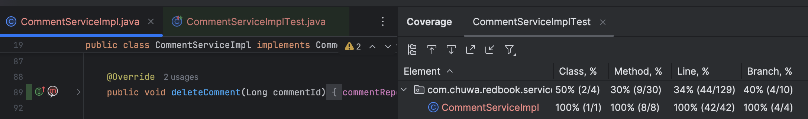

## 1. List and explain all the new learned annotations to your annotations.md
    see Tech\ Question/hw15/spring_annotations.md
## 2. What is the lifecycle of Junit?
    Class-level initialization (@BeforeAll):
        Methods annotated with @BeforeAll are executed once before any test methods in the class.
        This is typically used for initializing resources shared across all tests (e.g., opening a database connection).
        Methods must be static.
    Test-level setup (@BeforeEach):
        For each test method, @BeforeEach runs before the specific test starts.
        Commonly used to reset instance variables or mock objects to a clean state.
    Test execution (@Test):
        The method annotated with @Test is executed.
        This is where the actual test logic resides.
    Test-level teardown (@AfterEach):
        After a test finishes, @AfterEach is executed to clean up resources allocated during the test (e.g., closing file streams).
    Class-level cleanup (@AfterAll):
        Once all tests in the class are finished, @AfterAll is executed.
        This is used for cleaning up shared resources initialized in @BeforeAll.
## 3. Explain parameterized testing?
    Parameterized testing allows you to run the same test multiple times with different input values. 
    This is useful when you want to validate a method or function against a variety of inputs and expected outputs without writing duplicate code for each case.
    Parameterized Testing in JUnit
        JUnit 5 Parameterized Tests
            JUnit 5 provides the @ParameterizedTest annotation for parameterized tests. It also includes multiple sources for providing test parameters.
            Annotations in JUnit 5
                @ParameterizedTest: Marks a test as parameterized.
                Parameter Sources:
                    @ValueSource: Provides a single array of values (e.g., integers, strings, etc.).
                    @CsvSource: Provides multiple arguments in a CSV format.
                    @CsvFileSource: Loads parameters from a CSV file.
                    @MethodSource: Provides parameters from a factory method.
                    @ArgumentsSource: Allows custom argument providers.
## 4. Explain Mockito and PowerMock.
    Mockito
        What is Mockito?
            Mockito is a mocking framework primarily used to create test doubles for dependencies. It enables you to test components in isolation by mocking their dependencies' behaviors.
        Key Features of Mockito
            Mocking: Create mock objects to simulate dependencies in your unit tests.
            Stubbing: Define the behavior of mocked methods for specific inputs.
            Verification: Verify how mocked objects and methods are called during the test.
            Spy: Partially mock objects while still calling real methods on them.
            Exception Handling: Stub methods to throw exceptions for specific inputs.
            Argument Matchers: Use flexible matchers for arguments during stubbing and verification.
        When to Use Mockito?
            To isolate the unit under test by mocking its dependencies.
            To verify interactions between objects.
            When the dependencies are interfaces or simple classes without static, final, or private methods.
    PowerMock
        What is PowerMock?
            PowerMock is an extension of Mockito (or other mocking frameworks) that allows you to mock static, final, private, or constructor methods, which Mockito cannot do by itself.
        Key Features of PowerMock
            Mock Static Methods: Mock static method calls.
            Mock Final Classes or Methods: Mock methods or classes marked as final.
            Mock Private Methods: Access and mock private methods.
            Mock Constructors: Mock object creation using constructors.
            PowerMockito Integration: Extends Mockito's functionality for special use cases.
        When to Use PowerMock?
            When dealing with legacy code that contains static or final methods.
            When mocking private methods or constructors is unavoidable.
            When you need to mock classes or methods that cannot be easily refactored.
## 5. Compare @Mock and @InjectMock
    @Mock
        Purpose
            Used to create mock objects of dependencies. It helps simulate the behavior of real objects in isolation.
        Key Features
            The mocked object is fully controlled in the test class. 
            You can define specific behaviors for methods of the mock (stubbing).
            Dependency injection is not automatically performed; you need to inject mocks manually if required.
    @InjectMocks
        Purpose
            Used to create an instance of the class under test (i.e., the class being tested).
            Automatically injects all the mocks (annotated with @Mock) into the class under test.
        Key Features
            Helps reduce boilerplate code for setting up dependencies.
            Works with constructor, setter, or field injection to inject mocks into the class under test.
            Ensures that the class being tested is initialized with its mocked dependencies.
```java
import org.junit.jupiter.api.Test;
import org.mockito.InjectMocks;
import org.mockito.Mock;
import org.mockito.MockitoAnnotations;

import static org.mockito.Mockito.*;

class UserServiceTest {

    @Mock
    private UserRepository userRepository; // Dependency to be mocked

    @InjectMocks
    private UserService userService; // Class under test, with dependencies injected

    @Test
    void testUserServiceWithInjectMocks() {
        // Initialize mocks and inject them
        MockitoAnnotations.openMocks(this);

        // Stub the behavior of the mock
        when(userRepository.findUserById(1)).thenReturn(new User(1, "John"));

        // Call the method on the class under test
        User user = userService.getUserDetails(1);

        // Assertions
        assertEquals("John", user.getName());
        verify(userRepository).findUserById(1);
    }
}
```
## 6. Explain stubbing.
    Stubbing is the process of defining specific behaviors for methods of a mock object in your unit tests. 
    It allows you to specify how a mock should respond when its methods are called with certain arguments. 
    This helps simulate the behavior of external dependencies in a controlled way during testing.
    For example, if you're testing a service that depends on a repository, you can stub the repository methods to return predefined results.

    Key Stubbing Methods in Mockito
        thenReturn(value): Returns a specific value when the method is called.
        thenThrow(exception): Throws a specific exception when the method is called.
        thenAnswer(answer): Defines custom logic for the stubbed method.
        thenCallRealMethod(): Calls the real method on the object (useful with spies).
## 7. What is Mockito ArgumentMatchers
    In Mockito, ArgumentMatchers (previously called Matchers) are used to define flexible rules for matching method arguments when stubbing or verifying interactions with mocked objects. 
    Instead of using exact values for arguments, ArgumentMatchers allow you to use patterns or conditions to match arguments dynamically.
```java
/**
 * Simple Stubbing with Matchers
 */
import static org.mockito.Mockito.*;
import static org.mockito.ArgumentMatchers.*;

class UserServiceTest {

    @Test
    void testWithAnyMatcher() {
        UserRepository mockRepository = mock(UserRepository.class);

        // Stubbing using ArgumentMatcher
        when(mockRepository.findUserById(anyInt())).thenReturn(new User(1, "John"));

        // Call the method
        User user = mockRepository.findUserById(100);

        // Assert the result
        assertEquals("John", user.getName());
    }
}

/**
 * Custom Matching with argThat
 */
class UserServiceTest {
    @Test
    void testWithCustomMatcher() {
        UserRepository mockRepository = mock(UserRepository.class);

        // Custom condition: Match only when the ID is greater than 10
        when(mockRepository.findUserById(argThat(id -> id > 10))).thenReturn(new User(2, "Alice"));

        // Call the method
        User user = mockRepository.findUserById(15);

        // Assert the result
        assertEquals("Alice", user.getName());
    }
}

/**
 * Verification with Matchers
 */
class UserServiceTest {

    @Test
    void testVerificationWithMatchers() {
        UserRepository mockRepository = mock(UserRepository.class);

        // Call the method
        mockRepository.findUserById(42);

        // Verify that the method was called with any integer
        verify(mockRepository).findUserById(anyInt());
    }
}
```
    When to Use ArgumentMatchers：
        When exact argument values are unpredictable or irrelevant for the test.
        When simulating method behavior for a range of inputs.
        When verifying method calls without focusing on specific arguments.
## 8. Compare @spy and @Mock?
    @Mock
        Purpose
            @Mock is used to create mock objects of a class or interface.
            Mocks are completely controlled, and none of the original functionality is preserved.
            It's ideal for when you want to isolate the object under test and replace its dependencies with fake behaviors.
        Key Features
            Fully Mocked Objects: All methods are stubbed by default.
            No Real Method Calls: All method calls on mocked objects are replaced by behavior you define.
            Behavior Control: You can use when(...).thenReturn(...) to define the behavior of the mock.
    @Spy
        Purpose
            @Spy is used to create partial mocks. It allows you to mock certain methods of a class, while still retaining the real behavior of other methods.
            It is ideal when you want to mock specific methods of an existing object but still keep the object's real behavior for the rest of the methods.
        Key Features
            Partial Mocks: Real methods are called unless explicitly stubbed.
            Real Method Calls: If a method is not stubbed, the real method implementation is invoked.
            Flexible Stubbing: Allows for overriding the behavior of specific methods while keeping the default behavior for others.
```java
import static org.mockito.Mockito.*;

// Spy Example
class UserServiceTest {

    @Spy
    private UserRepository spyRepository; // Partially mocked dependency

    @Test
    void testGetUserDetails() {
        // Initialize the spy
        MockitoAnnotations.openMocks(this);

        // Stub the method you want to mock
        when(spyRepository.findUserById(1)).thenReturn(new User(1, "John"));

        // Call the method (real method for other operations)
        User user = spyRepository.findUserById(1);

        // Assert the result
        assertEquals("John", user.getName());

        // Verify the interaction with the spy
        verify(spyRepository).findUserById(1);
    }
}
```
## 9. Explain Assertion.
    An assertion in the context of unit testing is a statement used to verify that the output or behavior of the code under test is correct. 
    It acts as a check to confirm that a specific condition holds true. If the condition is false, the test fails, indicating that there might be a bug or issue in the code.
    Assertions are crucial in automated testing because they provide a way to automatically verify that the code behaves as expected under various conditions, without manual intervention.
    Why Use Assertions?
        Validation: They confirm that your code behaves correctly and that the output matches expectations.
        Error Detection: They help identify issues early in development by ensuring the system behaves as expected.
        Automation: Assertions are automated, meaning they can run continuously in a continuous integration (CI) environment, detecting issues before they reach production.
        Test Reliability: Assertions ensure that your tests are repeatable and reliable, allowing them to be automated and run on every build.
```java
import static org.junit.jupiter.api.Assertions.*;
import org.junit.jupiter.api.Test;

class UserServiceTest {

    @Test
    void testUserRegistration() {
        UserService userService = new UserService();
        
        // Assume User object constructor and method implementations are available
        User newUser = new User("John", "Doe");
        
        // Register user
        User registeredUser = userService.register(newUser);
        
        // Assert user registration
        assertNotNull(registeredUser); // Verifies the registered user is not null
        assertEquals("John", registeredUser.getFirstName()); // Verifies first name is correct
        assertTrue(userService.isRegistered(registeredUser)); // Verifies user is successfully registered
    }
}
```
## 10. Add unit tests for CommentServiceImpl under Redbook->branch 10_testing (fork or copy the project https://github.com/CTYue/springboot-redbook),
    1. Enrich logics inside CommentServiceImpl methods, add if-else conditions in each methods.
        see [CommentServiceImpl.java](/Coding/hw14/redbook/src/main/java/com/chuwa/redbook/service/impl/CommentServiceImpl.java)
    2. In CommentServiceImpl, add following method, remove modelMapper dependency, and replace all modelMapper.map() with this method, write unit test for commentServiceMapperUtil
```java
public static CommentDto commentServiceMapperUtil(Comment comment) {
   ModelMapper modelMapper = new ModelMapper();
   return modelMapper.map(comment, CommentDto.class);
}
```
        see [CustomizedMapperTest.java](../../Coding/hw14/redbook/src/test/java/com/chuwa/redbook/util/mapper/CustomizedMapperTest.java)
    3. Method coverage and branch coverage for CommentServiceImpl should be 100% (as much as you can).
        see [CommentServiceImplTest.java](../../Coding/hw14/redbook/src/test/java/com/chuwa/redbook/service/impl/CommentServiceImplTest.java)
        see 
