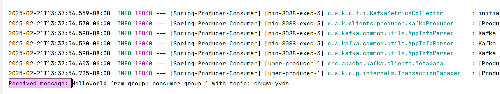
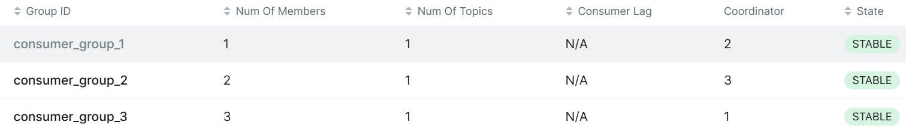
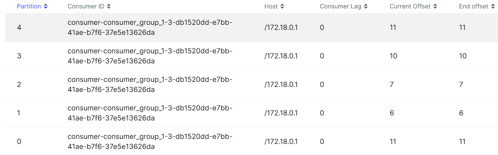
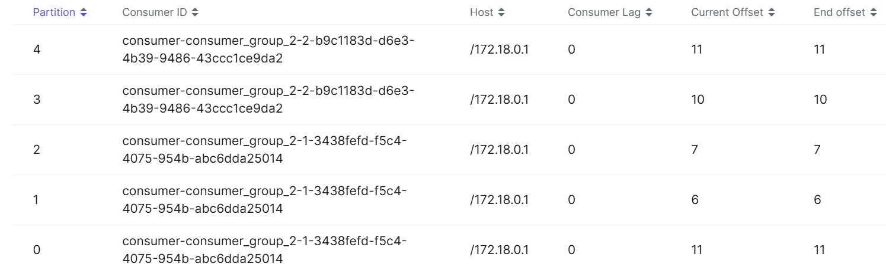
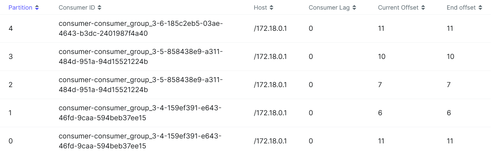

```
Topic: A logical channel where messages are categorized and stored. Producers write to topics, and consumers read from them.

Partition: A topic is split into multiple partitions for parallel processing. Each partition is stored on different brokers for scalability and fault tolerance.

Broker: A Kafka server that stores topic partitions and handles read/write requests from producers and consumers.

Consumer Group: A group of consumers that collaboratively consume messages from a topic’s partitions. Each partition is read by only one consumer in the group at a time.

Producer: Sends messages to Kafka topics. Messages are distributed across partitions based on a key or round-robin.

Offset: A unique ID for each message in a partition, allowing consumers to track their read position.

Zookeeper: Manages Kafka cluster metadata, leader election for partitions, and keeps track of broker health
```

\1. Given N (number of partitions) and M (number of consumers,) what will happen when N>=M and N<M
respectively?  

```
N ≥ M: Each consumer gets at least one partition, maximizing parallel processing.
N < M: Some consumers will be idle since a partition can be consumed by only one consumer in a group at a time.
```

\2. Explain how brokers work with topics?  

```
Brokers store topic partitions and replicate them across nodes.
A leader partition on one broker handles reads/writes, while replicas on other brokers act as backups.
```

\3. Are messages pushed to consumers or consumers pull messages from topics?  

```
Consumers pull messages from Kafka based on their offset
```

\4. How to avoid duplicate consumption of messages?  

```
Use idempotent producers and exactly-once semantics (Kafka transactions).
or Consumers commit offsets after successful processing.
```

\5. What will happen if some consumers are down in a consumer group? Will data loss occur? Why?  

```
Kafka rebalance assigns their partitions to remaining consumers.
No data loss, as unprocessed messages remain in Kafka.
```

\6. What will happen if an entire consumer group is down? Will data loss occur? Why?  

```
Messages stay in Kafka until retention expires.
No data loss, but messages will be unprocessed until consumers restart.
```

\7. Explain consumer lag and how to resolve it?  

```java
Lag: Difference between latest message and last consumed offset.
Fix: Increase consumer instances, optimize processing, or ensure consumers keep up with the producer rate.
```

\8. Explain how Kafka tracks message delivery?  

```
Uses offsets stored in Kafka
Consumers commit offsets after processing, allowing recovery from the last committed position.
```

\9. Compare Kafka vs RabbitMQ, compare messageing frameworks vs MySql (Why Kafka)?  

| Feature       | **Kafka**                        | **RabbitMQ**                     | **MySQL (DB for Messaging)**                 |
| ------------- | -------------------------------- | -------------------------------- | -------------------------------------------- |
| Model         | Pub-sub, log-based               | Queue-based, message broker      | RDBMS with polling                           |
| Message Order | Ordered within a partition       | FIFO (per queue)                 | No ordering guarantees                       |
| Scalability   | Horizontally scalable            | Limited scalability              | Not designed for scalability                 |
| Performance   | High throughput                  | Lower than Kafka                 | Inefficient for messaging                    |
| Use Case      | Event streaming, logs, analytics | Task queues, RPC, real-time jobs | Persistent storage, transactional operations |

```
Why Kafka:

Handles high throughput with horizontal scalability.
Guarantees message ordering within partitions.
Supports replayability (messages persist for retention period).
Fault-tolerant with leader-follower replication.
real-time event processing, log aggregation, and distributed microservices communication
```


10.



when increasing the number of consumers:

Consumers are assigned partitions dynamically

Partition rebalancing happens when consumers join/leave the group.

If partitions < consumers, some consumers will be idle.

If partitions > consumers, some consumers will handle multiple partitions.


when multiple consumer groups:

Each consumer group has its own offset tracking.

Consumers in the same group split partitions, while different groups consume all messages independently.









```java
//At-most-once
//Producer sends a message but does not wait for Kafka acknowledgment.
props.put(ProducerConfig.ACKS_CONFIG, "0"); 
props.put(ProducerConfig.RETRIES_CONFIG, "0"); // No retries
//consumer Auto commits offsets without confirming processing
props.put(ConsumerConfig.ENABLE_AUTO_COMMIT_CONFIG, "true"); 
props.put(ConsumerConfig.AUTO_COMMIT_INTERVAL_MS_CONFIG, "1000"); 

//At-least-once
//producer Waits for full replication before confirming
props.put(ProducerConfig.ACKS_CONFIG, "all");
props.put(ProducerConfig.RETRIES_CONFIG, "3"); // Retries if failure occurs
//consumer Manually commit offsets
props.put(ConsumerConfig.ENABLE_AUTO_COMMIT_CONFIG, "false"); 

@KafkaListener(topics = "test-topic", groupId = "test-group")
public void consume(ConsumerRecord<String, String> record, Acknowledgment ack) {
    System.out.println("Consumed: " + record.value());
    ack.acknowledge();  // Commit offset after processing
}

//Exactly-once
//producer ensures duplicate messages are not sent
props.put(ProducerConfig.ENABLE_IDEMPOTENCE_CONFIG, "true");  
props.put(ProducerConfig.TRANSACTIONAL_ID_CONFIG, "my-transactional-producer");
//consumer only read committed messages
props.put(ConsumerConfig.ISOLATION_LEVEL_CONFIG, "read_committed"); 
props.put(ConsumerConfig.ENABLE_AUTO_COMMIT_CONFIG, "false"); // Manual commit

//producer:
KafkaProducer<String, String> producer = new KafkaProducer<>(props);
producer.initTransactions(); 

try {
    producer.beginTransaction();
    ProducerRecord<String, String> record = new ProducerRecord<>("test-topic", "key", "message");
    producer.send(record);
    producer.commitTransaction(); // Commit if everything succeeds
} catch (Exception e) {
    producer.abortTransaction(); // Rollback in case of failure
}

//consumer:
@KafkaListener(topics = "test-topic", groupId = "test-group")
public void consumeWithTransaction(ConsumerRecord<String, String> record, Acknowledgment ack) {
    try {
        System.out.println("Processing: " + record.value());
        // Process message...
        ack.acknowledge();  // Commit offset after successful processing
    } catch (Exception e) {
        // Don't commit offset if processing fails
    }
}

```


| Guarantee     | Producer Acks            | Consumer Offset Commit       | Pros                   | Cons               |
| ------------- | ------------------------ | ---------------------------- | ---------------------- | ------------------ |
| At-most-once  | `acks=0`                 | Auto commit                  | Fastest, Low overhead  | May lose messages  |
| At-least-once | `acks=all` + retries     | Manual commit                | No loss, Reliable      | May get duplicates |
| Exactly-once  | `acks=all` + Idempotence | Transactions + Manual commit | No loss, No duplicates | Slightly slower    |

**At-most-once:** Use for low-priority logs where speed matters more than reliability.

**At-least-once:** Default and safest for most applications.

**Exactly-once:** Use for financial transactions, order processing, or critical applications.