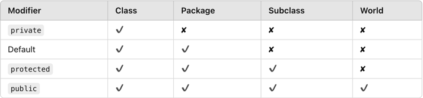
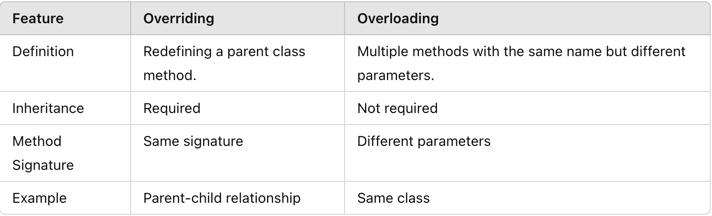

# hw2

---

### 1. Write up Example code to demonstrate the three foundmental concepts of OOP. (reference Code Demode as example)
1. Encapsulation;
2. Polymorphism;
3. Inheritance;

### 2. What is wrapper class in Java and Why we need wrapper class?
- **Wrapper Classes:** Provide object representation for primitive types (e.g., Integer for int).

- **Why?**
  1. To use primitives in Collections.
  2. Provides utility methods (e.g., parseInt).

### 3. What is the difference between HashMap and HashTable?

### 4. What is String pool in Java and why we need String pool?
- The **String Pool** is a special memory area inside the Heap, where String literals are stored. When two strings are identical, they share the same reference in the pool, improving memory efficiency.

### 5. What is Java garbage collection?
- **Garbage Collection (GC)** is an automatic memory management process where the JVM identifies and removes unused objects from memory.

- **Key Points:**
  1. Manual Trigger: System.gc() (JVM decides whether to run GC).
  2. GC Process: Mark, Sweep, and Compact phases.

### 6. What are access modifiers and their scopes in Java?

### 7. What is `final` key word? (Filed, Method, Class)
- `final` for Variables: Value cannot be changed.
- `final` for Methods: Cannot be overridden.
- `final` for Classes: Cannot be extended.

### 8. What is `static` keyword? (Filed, Method, Class). When do we usually use it?
- Static Fields/Methods: Belong to the class, not instances.
- Use Cases:
  1. Shared resources.
  2. Utility methods.

### 9. What is the differences between overriding and overloading?

### 10. What is the differences between super and this?
- `this`: Refers to the current instance.
- `super`: Refers to the parent class instance.

### 11. What is the Java load sequence?
- **Static Blocks/Variables**: Loaded first when the class is loaded.
- **Instance Variables**: Initialized when the object is created.
- **Constructor**: Called after instance variables.

### 12. What is Polymorphism ? And how Java implements it ?
- **Polymorphism** allows methods to perform differently based on the object.

  1. **Compile-Time**: Method Overloading.
  2. **Run-Time**: Method Overriding.

### 13. What is Encapsulation ? How Java implements it? And why we need encapsulation?
- **Encapsulation** is the process of hiding fields using private modifiers and exposing them via public methods.

- **Why**?
  1. Protects data integrity.
  2. Provides controlled access.

### 14. What is Interface and what is abstract class? What are the differences between them?

### 15. design a parking lot (put the code to codingQuestions/coding1 folder)
1. If you have no ability to design it, please find the solution in internet, then understand it, and re-type it.(Do NOT just copy and paste)

### 16. What are Queue interface implementations and what are the differences and when to use what?
1. **LinkedList**: Non-thread-safe, general-purpose queue.
2. **PriorityQueue**: Elements are ordered by priority.
3. **ArrayBlockingQueue**: Thread-safe, fixed-size queue.
- **Use Cases**:
  - LinkedList for basic queues.
  - PriorityQueue for scheduling.
  - BlockingQueue for multithreading.