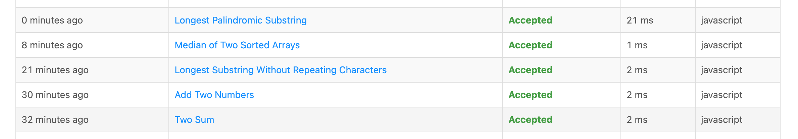
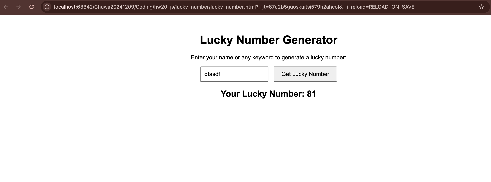
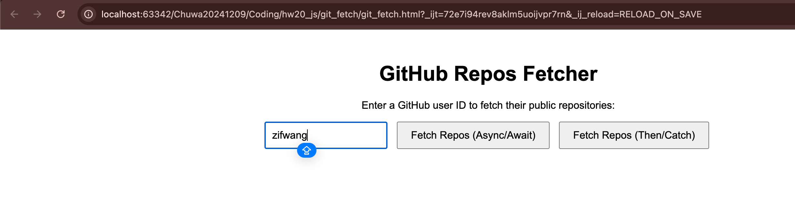
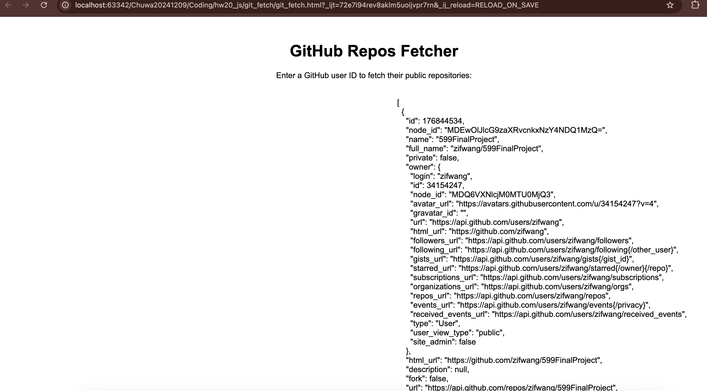

## 1. Read and practice all sample codes from 71-Dom-Bom-JavaScript-Typescript-Node.md on your local browser or an online compiler.
## 2. Resolve 5 leetcode problems using Javascript.
    Image: 
## 3. Compare let vs var , explain variable hosting with your own code examples.
    Both let and var are used to declare variables in JavaScript, but they have key differences:
| Feature                | var                                                           | let                              |
|------------------------|---------------------------------------------------------------|----------------------------------|
| Scope                  | Function-scoped                                               | Block-scoped                     |
| Hoisting               | Hoisted and initialized with undefined                        | Hoisted but not initialized      |
| Re-declaration         | Allowed within the same scope                                 | Not allowed in the same scope    |
| Global Object Property | Declares global variables as properties of window in browsers | Does not add variables to window |
```javascript
// Scope Difference
function testScope() {
    if (true) {
        var x = 10; // Function-scoped
        let y = 20; // Block-scoped
    }
    console.log(x); // Works: x is available within the entire function
    console.log(y); // Error: y is block-scoped
}
testScope();

// Hoisting with var
var a; // Hoisting moves declaration to the top
console.log(a); // undefined
a = 5;
console.log(a); // 5

// Hoisting with let
console.log(b); // ReferenceError: Cannot access 'b' before initialization
let b = 10;
console.log(b);

// Re-declaration Behavior
var name = "Alice";
var name = "Bob"; // No error

let age = 25;
let age = 30; // SyntaxError: Identifier 'age' has already been declared
```

## 4. Explain closure with code example
    A closure is a function that retains access to its outer scope (lexical scope) even after the outer function has finished executing.
    In other words, a closure allows a function to "remember" variables from its outer scope, even after that scope has exited.
```javascript
// Basic Closure
function outerFunction() {
    let outerVariable = "I am from outer function";

    function innerFunction() {
        console.log(outerVariable); // Can access `outerVariable`
    }

    return innerFunction;
}

const myClosure = outerFunction(); // Executes outerFunction, returns innerFunction
myClosure(); // Still remembers `outerVariable`

// Closures with Private Variables
function counter() {
    let count = 0; // Private variable

    return {
        increment: function () {
            count++;
            console.log("Count:", count);
        },
        decrement: function () {
            count--;
            console.log("Count:", count);
        }
    };
}

const myCounter = counter();
myCounter.increment(); // Count: 1
myCounter.increment(); // Count: 2
myCounter.decrement(); // Count: 1

// Closures in Loops (Common Pitfall and Fix)
function createCounters() {
    let counters = [];

    // var i is function-scoped, so by the time the loop finishes, i = 3.
    // Each function in counters references the same i.
    for (var i = 0; i < 3; i++) {
        counters.push(function () {
            console.log(i);
        });
    }

    return counters;
}

const myCounters = createCounters();
myCounters[0](); // 3 (not 0)
myCounters[1](); // 3 (not 1)
myCounters[2](); // 3 (not 2)
```

## 5. Explain Callback Hell with code example
    Callback Hell (also known as "Pyramid of Doom") occurs when multiple nested callbacks make code hard to read and maintain.
    It happens when handling asynchronous operations (e.g., API requests, database calls, file I/O) using callback functions.
    Let's say we need to:
        1. Fetch user data from a database.
        2. Get the user's orders.
        3. Retrieve details of each order. 
        4. Process the order and send a confirmation.
```javascript
/**
 * Example
 */

function getUser(userId, callback) {
    setTimeout(() => {
        console.log("Fetched user data");
        callback({ id: userId, name: "John" });
    }, 1000);
}

function getOrders(user, callback) {
    setTimeout(() => {
        console.log(`Fetched orders for ${user.name}`);
        callback([{ orderId: 1 }, { orderId: 2 }]);
    }, 1000);
}

function getOrderDetails(order, callback) {
    setTimeout(() => {
        console.log(`Fetched details for order ${order.orderId}`);
        callback({ orderId: order.orderId, details: "Order details" });
    }, 1000);
}

function processOrder(order, callback) {
    setTimeout(() => {
        console.log(`Processed order ${order.orderId}`);
        callback();
    }, 1000);
}

// Callback Hell Begins ⬇️
getUser(101, (user) => {
    getOrders(user, (orders) => {
        getOrderDetails(orders[0], (orderDetails) => {
            processOrder(orderDetails, () => {
                console.log("Order processing complete");
            });
        });
    });
});
```
## 6. Explain Promise, Async, Await with code examples.
    1. Promise: 
        A Promise represents a value that might be available now, later, or never.
        States of a Promise
            1. Pending → Initial state, not fulfilled or rejected.
            2. Fulfilled → Operation completed successfully.
            3. Rejected → Operation failed.
```javascript
/**
 * Example
 */

const myPromise = new Promise((resolve, reject) => {
    setTimeout(() => {
        let success = true; // Change to false to test rejection
        if (success) {
            resolve("Operation Successful!");
        } else {
            reject("Operation Failed!");
        }
    }, 2000);
});

// Handling Promise
myPromise
    .then((message) => console.log(message)) // Runs if resolved
    .catch((error) => console.error(error)) // Runs if rejected
    .finally(() => console.log("Promise Completed!"));

/**
 * Chain Promises
 * Promises can be chained to execute asynchronous operations sequentially.
 */
function fetchData() {
    return new Promise((resolve) => {
        setTimeout(() => resolve("Data Fetched"), 1000);
    });
}

function processData(data) {
    return new Promise((resolve) => {
        setTimeout(() => resolve(`${data} → Processed`), 1000);
    });
}

function saveData(data) {
    return new Promise((resolve) => {
        setTimeout(() => resolve(`${data} → Saved`), 1000);
    });
}

// Chaining Promises
fetchData()
    .then(processData)
    .then(saveData)
    .then((finalResult) => console.log("Final Output:", finalResult))
    .catch((error) => console.error("Error:", error));
```
    2. Async/Await: The Cleaner Alternative
        async and await make asynchronous code look like synchronous code, improving readability.
```javascript
/**
 * Example
 */

async function fetchData() {
    return new Promise((resolve) => {
        setTimeout(() => resolve("Data Fetched"), 1000);
    });
}

async function processData(data) {
    return new Promise((resolve) => {
        setTimeout(() => resolve(`${data} → Processed`), 1000);
    });
}

async function saveData(data) {
    return new Promise((resolve) => {
        setTimeout(() => resolve(`${data} → Saved`), 1000);
    });
}

async function handleData() {
    try {
        const data = await fetchData();
        const processedData = await processData(data);
        const savedData = await saveData(processedData);
        console.log("Final Output:", savedData);
    } catch (error) {
        console.error("Error:", error);
    }
}

handleData();

/**
 * Handling Multiple Async Calls in Parallel with Promise.all()
 */
async function fetchAllData() {
    try {
        const [user, orders, reviews] = await Promise.all([
            fetchUserData(),
            fetchOrders(),
            fetchReviews(),
        ]);
        console.log("All Data Fetched:", { user, orders, reviews });
    } catch (error) {
        console.error("Error Fetching Data:", error);
    }
}

fetchAllData();
```
## 7. Write an HTML page that generates a lucky number based on the date, time, and user inputs. Users should be able to get their random lucky numbers by clicking a button or using the enter key after typing the input.
    Code: [lucky_number.html](../../Coding/hw20_js/lucky_number/lucky_number.html)
    Image: 
## 8. Write an HTML page that returns a user's GitHub repos (https://api.github.com/users/{user_id}/repos) in JSON format. The web page should have a text box and a submit button where users can provide the GitHub user ID. The fetch call should be asynchronous. If the call to the above API fails for any reason, you should return a customized, user-friendly error message. If you know more than one approach to implement the asynchronous call, please do it using different approaches.
    Code: [git_fetch.html](../../Coding/hw20_js/git_fetch/git_fetch.html)
    Image:  && 
## 9. Explain how Javascript implement asynchronous non-blocking feature. Particularly: Event Loop, Macrotask, and Microtask with code samples.
    JavaScript is single-threaded, meaning it executes one operation at a time. However, it handles asynchronous operations efficiently using:
        1. Event Loop
        2. Macrotasks (Task Queue)
        3. Microtasks (Job Queue)
    These features allow JavaScript to perform non-blocking I/O, like handling user interactions, API requests, or timers without freezing the UI.
    1. Event Loop (The Heart of Async Execution)
        How It Works
            1. JavaScript runs synchronous code first (Call Stack).
            2. Async tasks (e.g., setTimeout, fetch, Promises) move to the Web API.
            3. Once async operations complete, they enter either:
            4. Macrotask Queue (e.g., setTimeout, setImmediate, I/O tasks)
            5. Microtask Queue (e.g., Promise.then(), MutationObserver)
        Event Loop checks:
            1. If the Call Stack is empty, it first executes all Microtasks.
            2. Then, it executes one Macrotask.
            3. Repeats the cycle.
    2. Macrotask vs Microtask
| Macrotask (Lower Priority)	                                 | Microtask (Higher Priority)	                       |
|-------------------------------------------------------------|----------------------------------------------------|
| setTimeout(), setInterval(), setImmediate(), I/O operations | Promise.then(), MutationObserver, queueMicrotask() |
```javascript
/**
 * Example
 * Execution Order: 
 *  1. Start
 *  2. Sync Code End
 *  3. Promise Microtask
 *  4. Chained Promise Microtask
 *  5. queueMicrotask
 *  6. setTimeout (Macrotask)
 * Why? 
 *  Synchronous Code Runs First (console.log(1,2))
 *  Microtasks Run Next:
 *      First Promise.then() runs (console.log(3))
 *      Then, the chained Promise.then() (console.log(4))
 *      Next, queueMicrotask() runs (console.log(5))
 *  Macrotask Runs Last (setTimeout() - console.log(6))
 */
console.log("1. Start");

// Macrotask
setTimeout(() => console.log("6. setTimeout (Macrotask)"), 0);

// Microtask
Promise.resolve().then(() => {
    console.log("3. Promise Microtask");
    return Promise.resolve();
}).then(() => console.log("4. Chained Promise Microtask"));

// Microtask
queueMicrotask(() => console.log("5. queueMicrotask"));

// Synchronous
console.log("2. Sync Code End");
```