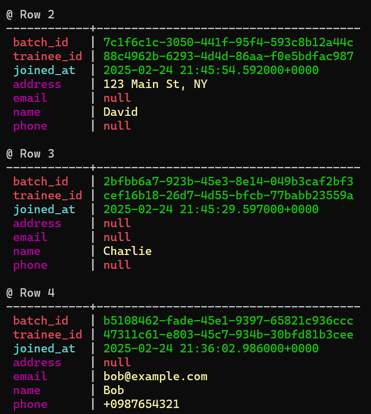

create a new keyspace "chuwa"

```cassandra
CREATE KEYSPACE chuwa 
WITH replication = {'class': 'SimpleStrategy', 'replication_factor': 1};
```

create a new table "trainee_information" with necessary columns, setup multiple partition keys, setup a clustering key column using timestamp data type, Use proper data types for other columns

```cassandra
CREATE TABLE trainee_information (
    batch_id UUID,
    trainee_id UUID,
    name TEXT,
    email TEXT,
    phone TEXT,
    joined_at TIMESTAMP,
    PRIMARY KEY ((batch_id, trainee_id), joined_at)
);

```

Insert multiple rows for above table.


Come up with queries to prove that Cassandra supports "flexible schema"

```cassandra
//The missing columns (email, phone) are not required.
INSERT INTO trainee_information (batch_id, trainee_id, name, joined_at) 
VALUES (uuid(), uuid(), 'Charlie', toTimestamp(now()));
//Schema can be changed dynamically.
ALTER TABLE trainee_information ADD address TEXT;
//New column does not require old records to be updated.
INSERT INTO trainee_information (batch_id, trainee_id, name, address, joined_at) 
VALUES (uuid(), uuid(), 'David', '123 Main St, NY', toTimestamp(now()));

```



Explain why Cassandra has a "Query-first design" with CQL query examples

```cassandra
//Cassandra schema and table structures are designed based on how data will be queried rather than traditional relational normalization.
//Data is distributed across multiple nodes based on partition keys, ensuring fast lookup. Clustering keys allow efficient sorting and retrieval within partitions.
```


Explain Cassandra consistency levels.

```
ALL: Write/read must be acknowledged by all replicas. Strongest consistency

QUORUM: Majority (n/2+1) of replicas must acknowledge. Good balance of availability and consistency.

ONE: Only one live replica needs to acknowledge. The data is immediately readable from at least one replica.

LOCAL_QUORUM: Ensures majority consistency within the local datacenter.

ANY: Write succeeds if any node stores a hint for later replay. Most available. The data may not be immediately readable if the receiving node is down, as hinted handoff stores the data temporarily for later delivery. 
```

