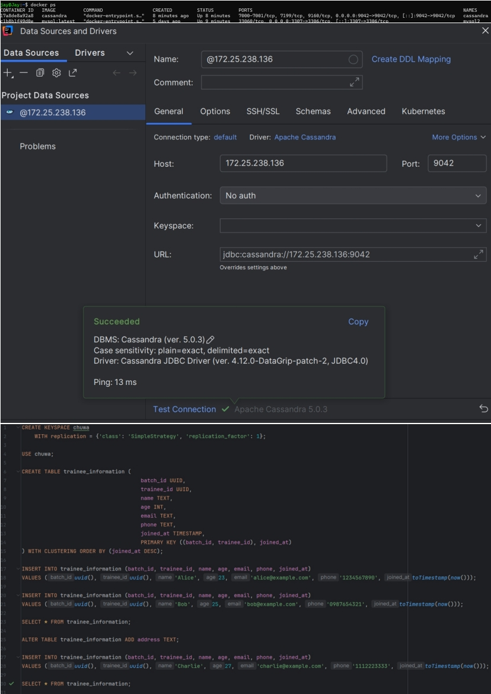

# Homework 21




## 6. Come up with queries to prove that Cassandra supports "flexible schema"
Cassandra allows dynamic schema modifications without affecting existing data.
- Adding a New Column Dynamically: 
  ```
  ALTER TABLE trainee_information ADD address TEXT;
  ```
- Inserting New Data Without the New Column:
  ```
  INSERT INTO trainee_information (batch_id, trainee_id, name, age, email, phone, joined_at) 
  VALUES (uuid(), uuid(), 'Charlie', 27, 'charlie@example.com', '1112223333', toTimestamp(now()));
  ```
**Observations:** The old records will have NULL for the newly added address column. The new records can either provide a value for address or leave it empty. This demonstrates that Cassandra allows schema modifications dynamically without requiring data migration or affecting existing rows.

## 7. Explain why Cassandra has a "Query-first design" with CQL query examples
Cassandra follows a query-first design, meaning tables are structured based on expected queries rather than normalization. This ensures high-speed, efficient lookups in a distributed system by leveraging partition keys for data locality and clustering keys for sorting. Instead of joins, Cassandra denormalizes data to optimize reads. For example, retrieving a user's recent activities requires designing a table with ```PRIMARY KEY (user_id, activity_time)```, ensuring fast lookups with ```ORDER BY activity_time DESC. Similarly```, querying the latest sensor readings efficiently requires a table with ```PRIMARY KEY (device_id, reading_time)```. Multi-partition queries are avoided by pre-structuring data per query pattern, such as storing login activities in a separate ```activity_by_type``` table. 

## 8. Explain Cassandra consistency levels.
Cassandra's consistency levels control how many nodes must acknowledge a read or write operation before it is considered successful, balancing availability, fault tolerance, and data accuracy. Common levels include ONE (acknowledged by a single node, fast but less consistent), QUORUM (majority of replicas must confirm, balancing consistency and availability), and ALL (all replicas must confirm, ensuring strong consistency but reducing availability). For reads, LOCAL_ONE and LOCAL_QUORUM limit acknowledgment to nodes within the local datacenter, optimizing latency. ANY allows writes to be stored even if no replica is available, relying on hinted handoff.


