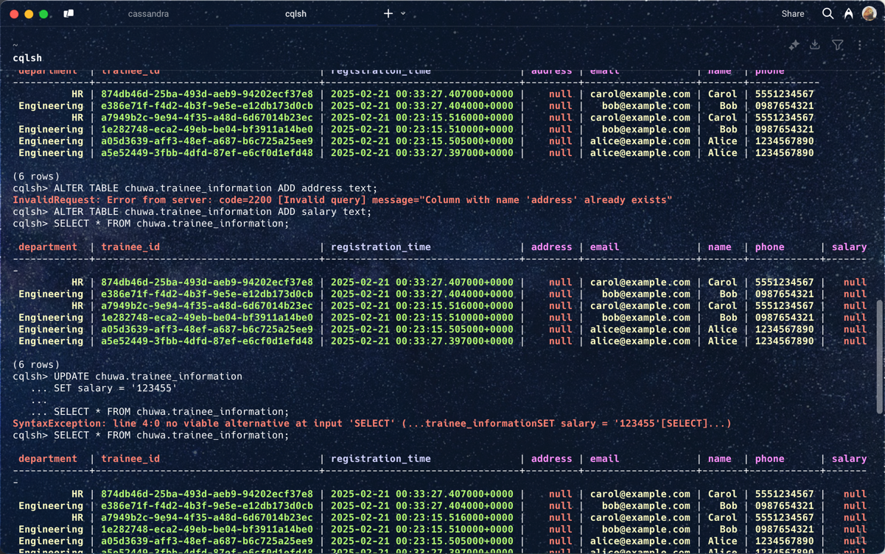

# 1. Why Cassandra Has a "Query-first Design"

Cassandra's data modeling approach is fundamentally **query-first**, meaning you design your schema based on your anticipated queries. This strategy is necessary because Cassandra is built for high performance in distributed environments and does not support complex JOIN operations.

## Reasons for Query-first Design

- **No JOIN Support:**  
  Cassandra does not allow complex joins. Therefore, to avoid expensive queries that require joining multiple tables, data must be denormalized and organized in a way that each query can be answered by a single table.

- **Efficient Data Retrieval:**  
  By carefully designing the **Partition Key** and **Clustering Key**, Cassandra can quickly locate and sort data across its distributed nodes.
    - The **Partition Key** determines which node(s) store the data.
    - The **Clustering Key** defines the order of data within a partition, facilitating efficient range queries.

- **Scalability:**  
  Because Cassandra distributes data across many nodes, having a well-defined query pattern (and thus a proper key design) is crucial to ensure that queries are local to a partition or node, avoiding full cluster scans.

## CQL Query Examples

Assume we have the following table:

```cql
CREATE TABLE trainee_information (
  department text,
  trainee_id uuid,
  registration_time timestamp,
  name text,
  email text,
  phone text,
  PRIMARY KEY ((department, trainee_id), registration_time)
);
```

Example 1: Query by Partition and Clustering Keys

Retrieve records for a specific trainee in the "Engineering" department after a certain registration time:
```cql
SELECT *
FROM trainee_information
WHERE department = 'Engineering'
  AND trainee_id = 11111111-2222-3333-4444-555555555555
  AND registration_time > '2025-02-20 00:00:00';

```

Example 2: Query Using Only a Partial Key (Not Recommended)

Querying only by the department without specifying the full partition key requires using ALLOW FILTERING, which is inefficient:
```cql
SELECT *
FROM trainee_information
WHERE department = 'Engineering'
ALLOW FILTERING;

```

# 2. Cassandra Consistency Levels

Cassandra allows you to configure the consistency level for read and write operations. This setting determines how many replica nodes must acknowledge an operation before it is considered successful. It lets you balance performance and data consistency according to your application's needs.

## Common Consistency Levels

1. ANY

- Writes: Successful if at least one node (or a hinted handoff) writes the data.
- Pros: Lowest latency.
- Cons: Weakest consistency guarantees.
2. ONE

- Reads/Writes: Only one replica must respond.
- Pros: Fast operations.
- Cons: May lead to temporary inconsistencies.
3. QUORUM

- Reads/Writes: A majority of the replicas (e.g., 2 out of 3) must respond.
- Pros: Good balance between consistency and performance.
- Cons: Slightly higher latency than ONE.
4. ALL

- Reads/Writes: All replicas must respond.
- Pros: Strongest consistency.
- Cons: Highest latency; if any replica is down, the operation fails.
5. LOCAL_QUORUM / LOCAL_ONE

- Reads/Writes: Limits the requirement to replicas within the local datacenter.
- Pros: Reduces cross-datacenter latency while maintaining consistency within a local region.
- Cons: Only applies to multi-datacenter setups.

Setting Consistency Levels in CQL
You can set the desired consistency level in the CQL shell (cqlsh) for your session:

```cql
CONSISTENCY QUORUM;
SELECT * FROM trainee_information;

```

Or for writes:

```cql
CONSISTENCY ONE;
INSERT INTO trainee_information (department, trainee_id, registration_time, name, email, phone)
VALUES ('Engineering', uuid(), toTimestamp(now()), 'Alice', 'alice@example.com', '1234567890');

```
Summary
- Query-first Design:
Cassandra's schema is built around the queries you plan to execute. This design avoids costly joins and ensures that data can be efficiently retrieved using well-defined partition and clustering keys.

- Consistency Levels:
Cassandra provides a range of consistency levels (from ANY to ALL, including local variants) that allow you to trade off between performance and data consistency. Adjusting these levels can help meet the specific needs of your application.


