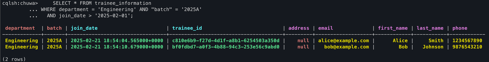

## Install Cassandra DB on your computer
```text
    1. docker pull cassandra:latest
    2. docker network create cassandra
    3. docker run --rm -d --name cassandra --hostname cassandra --network cassandra cassandra
    4. run cql: docker run --rm -it --network cassandra nuvo/docker-cqlsh cqlsh cassandra 9042 --cqlversion='3.4.7'
```
## create a new keyspace "chuwa"
```cql
    CREATE KEYSPACE chuwa WITH replication = {'class': 'SimpleStrategy', 'replication_factor': 1};
    USE chuwa;
```
## create a new table "trainee_information" with necessary columns, setup multiple partition keys
```cql
CREATE TABLE trainee_information (
    trainee_id UUID,
    first_name text,
    last_name text,
    department text,
    "batch" text,
    email text,
    phone text,
    join_date timestamp,
    PRIMARY KEY ((department, "batch"), join_date, trainee_id)
);
```
## Set up a clustering key column using timestamp data type
    1. Composite Partition Key: ((department, batch)) ensures data is partitioned based on both department and batch.
    2. Clustering Key: join_date (timestamp) orders rows within each partition, and adding trainee_id ensures uniqueness.
## Insert multiple rows for above table.
```cql
-- Inserting a trainee in the Engineering department, batch 2025A
INSERT INTO trainee_information (
    trainee_id, first_name, last_name, department, "batch", email, phone, join_date
) VALUES (
    uuid(), 'Alice', 'Smith', 'Engineering', '2025A', 'alice@example.com', '1234567890', toTimestamp(now())
);

-- Inserting another trainee in the same department and batch
INSERT INTO trainee_information (
    trainee_id, first_name, last_name, department, "batch", email, phone, join_date
) VALUES (
    uuid(), 'Bob', 'Johnson', 'Engineering', '2025A', 'bob@example.com', '9876543210', toTimestamp(now())
);

-- Inserting a trainee in the Marketing department, batch 2025B
INSERT INTO trainee_information (
    trainee_id, first_name, last_name, department, "batch", email, phone, join_date
) VALUES (
    uuid(), 'Charlie', 'Brown', 'Marketing', '2025B', 'charlie@example.com', '5551234567', toTimestamp(now())
);
```
## Use proper data types for other columns
## Come up with queries to prove that Cassandra supports "flexible schema"
    see 
    1. Altering the Table to Add a New Column
```cql
ALTER TABLE trainee_information ADD address text;
```
    2. Insert Data
```cql
INSERT INTO trainee_information (
    trainee_id, first_name, last_name, department, "batch", email, phone, join_date, address
) VALUES (
    uuid(), 'Diana', 'Prince', 'Marketing', '2025B', 'diana@example.com', '5559876543', toTimestamp(now()), '456 Wonder Way'
);
```
    3. Query Data
```cql
SELECT trainee_id, first_name, last_name, address FROM trainee_information;
```
## Explain why Cassandra has a "Query-first design" with CQL query examples
    1. Query by Partition Key (To quickly retrieve all trainees from the Engineering department and batch 2025A):
        see 
```cql
    SELECT * FROM trainee_information WHERE department = 'Engineering' AND "batch" = '2025A';
```
    2. Query with Clustering Key Range (To fetch trainees who joined after a certain date):
        see 
```cql
    SELECT * FROM trainee_information 
WHERE department = 'Engineering' AND "batch" = '2025A' 
  AND join_date > '2025-02-01';
```
    Why Query-First?
     * Denormalization: Data is duplicated into tables specifically designed for your queries.
     * Performance: Eliminates the need for expensive joins by having pre-modeled data.
     * Scalability: Data is partitioned to allow horizontal scaling, while the schema is designed around the queries rather than abstract entity relationships.
## Explain Cassandra consistency levels.
    see 
    Cassandra offers tunable consistency levels to balance between performance and data accuracy. Some common consistency levels include:
        ONE:
            Only one replica must acknowledge the read or write.
            Use case: Low latency operations where eventual consistency is acceptable.
        QUORUM:
            A majority (quorum) of replicas must respond.
            Use case: Balancing consistency and availability.
        ALL:
            All replicas must respond for an operation to be considered successful.
            Use case: Scenarios requiring strong consistency, though with higher latency.
        LOCAL_ONE / LOCAL_QUORUM:
            In multi-datacenter setups, these ensure operations are completed within the local datacenter before considering them successful.
    Setting Consistency in cqlsh
        Before running queries in cqlsh, you can set the desired consistency level:
```cql
CONSISTENCY QUORUM;
-- Insert
INSERT INTO trainee_information (
    trainee_id, first_name, last_name, department, "batch", email, phone, join_date
) VALUES (uuid(), 'Eve', 'Adams', 'Engineering', '2025A', 'eve@example.com', '1112223333', toTimestamp(now()));
```            
## Attached code and screenshots for above questions.
    see cql: [hw21.cql](hw21.cql)