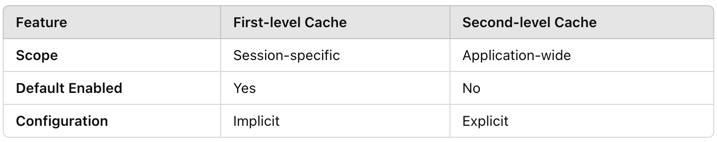

### Create oms_company_address table

### Insert some random data to oms_company_address table

### Write a SQL query to fetch all data from oms_company_address `table
```
SELECT * FROM oms_company_address;
```

### Write a SQL query to fetch top 3 records from oms_company_address table
```
SELECT * FROM oms_company_address 
ORDER BY id 
LIMIT 3;
```

### Update oms_company_address table to set all phone to 666-6666-8888
```
SET SQL_SAFE_UPDATES = 0;
UPDATE oms_company_address SET phone = '666-6666-8888';
SET SQL_SAFE_UPDATES = 1;

SELECT * FROM oms_company_address;
```

### Delete one entry from oms_company_address table
```
DELETE FROM oms_company_address 
WHERE id = 1;
SELECT * FROM oms_company_address;
```



### Create test DB
### Create oms_company_address collection (method: createCollection() )
```
db.createCollection("oms_company_address")
```
### Insert few random entries to oms_company_address collection (method: insert() )
```
db.oms_company_address.insertMany([
  {
    _id: 1,
    address_name: "Headquarters",
    send_status: 1,
    receive_status: 1,
    name: "John Smith",
    phone: "13812345678",
    province: "California",
    city: "Los Angeles",
    region: "Downtown",
    detail_address: "123 Tech Park Avenue, Suite 100"
  },
  {
    _id: 2,
    address_name: "Branch Office SF",
    send_status: 0,
    receive_status: 1,
    name: "Emma Davis",
    phone: "13923456789",
    province: "California",
    city: "San Francisco",
    region: "SoMa",
    detail_address: "456 Innovation Drive"
  },
  {
    _id: 3,
    address_name: "NYC Office",
    send_status: 1,
    receive_status: 0,
    name: "Michael Brown",
    phone: "13587654321",
    province: "New York",
    city: "New York City",
    region: "Manhattan",
    detail_address: "789 Business Center, 5th Ave"
  }
])
```
### Read one entry from oms_company_address collection (method: find() )
```
db.oms_company_address.find({_id: 1})
```
### Read all entries from oms_company_address collection (method: find() )
```
db.oms_company_address.find()
```
### Update one entry from oms_company_address collection (method: update() or save() )
```
db.oms_company_address.updateOne(
  { _id: 1 },
  { $set: { phone: "666-6666-8888" } }
)

```
### Remove one entry from oms_company_address collection (method: remove() )
```
db.oms_company_address.deleteOne({ _id: 1 })
```