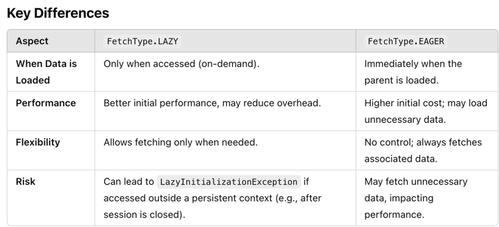

# hw9

---

### 1. What is JPA? and what is Hibernate?

- **JPA (Java Persistence API)** is a specification in Java for managing relational data in applications using object-relational mapping (ORM). It defines the standard set of APIs for creating, reading, updating, and deleting data from databases.

- **Hibernate** is a popular implementation of the JPA specification. It is an ORM framework that simplifies database interactions by mapping Java objects to database tables. Hibernate provides additional features like caching, lazy loading, and a query language (HQL) to enhance JPA's functionality.

### 2. What is Hiraki? what is the benefits of connection pool?
**HikariCP** is a high-performance JDBC connection pool library for Java. It efficiently manages database connections to optimize application performance.

**Benefits of Connection Pool:**
1. **Improved Performance:** Reuses connections instead of creating new ones for every request, reducing overhead.
2. **Faster Connection Management:** Quickly provides available connections, minimizing latency.
3. **Resource Efficiency:** Limits the number of open connections to avoid database overload.
4. **Scalability:** Handles multiple requests efficiently in high-concurrency environments.
5. **Thread Safety:** Manages connections in a thread-safe manner to avoid conflicts.

### 3. What is the @OneToMany, @ManyToOne, @ManyToMany? write some examples.
1. **@OneToMany**
   Represents a **one-to-many** relationship, where one entity is related to many entities.
```
@Entity
public class Department {
    @Id
    @GeneratedValue(strategy = GenerationType.IDENTITY)
    private Long id;

    private String name;

    @OneToMany(mappedBy = "department", cascade = CascadeType.ALL)
    private List<Employee> employees = new ArrayList<>();

    // Getters and Setters
}

@Entity
public class Employee {
    @Id
    @GeneratedValue(strategy = GenerationType.IDENTITY)
    private Long id;

    private String name;

    @ManyToOne
    @JoinColumn(name = "department_id")
    private Department department;

    // Getters and Setters
}

```
- Explanation:
  - A `Department` has many `Employees`.
  - `mappedBy` specifies the field in the `Employee` entity that maps this relationship.

2. **@ManyToOne**
   Represents a **many-to-one** relationship, where many entities are related to one entity.

**Example:**
(Using the Employee entity from the previous example)
```
@Entity
public class Employee {
    @Id
    @GeneratedValue(strategy = GenerationType.IDENTITY)
    private Long id;

    private String name;

    @ManyToOne
    @JoinColumn(name = "department_id")
    private Department department;

    // Getters and Setters
}
```
- **Explanation:**
  - Many `Employees` belong to one `Department`.
  - `@JoinColumn` defines the foreign key column in the database.

3. **@ManyToMany**
   Represents a **many-to-many** relationship, where many entities are related to many entities. This usually requires a join table.
```
@Entity
public class Student {
    @Id
    @GeneratedValue(strategy = GenerationType.IDENTITY)
    private Long id;

    private String name;

    @ManyToMany
    @JoinTable(
        name = "student_course",
        joinColumns = @JoinColumn(name = "student_id"),
        inverseJoinColumns = @JoinColumn(name = "course_id")
    )
    private List<Course> courses = new ArrayList<>();

    // Getters and Setters
}

@Entity
public class Course {
    @Id
    @GeneratedValue(strategy = GenerationType.IDENTITY)
    private Long id;

    private String title;

    @ManyToMany(mappedBy = "courses")
    private List<Student> students = new ArrayList<>();

    // Getters and Setters
}
```
- **Explanation:**
  - A Student can enroll in many Courses.
  - A Course can have many Students.
  - @JoinTable defines the join table and its foreign key mappings.

### 4. What is the `cascade = CascadeType.ALL, orphanRemoval = true`? and what are the other CascadeType and their features? In which situation we choose which one?

**CascadeType and orphanRemoval**
- In JPA, cascade and orphan removal are used to control the lifecycle of child entities in relation to their parent entity.

1. `cascade = CascadeType.ALL`
   - Propagates all operations (e.g., `PERSIST`, `MERGE`, `REMOVE`) from a parent entity to its related child entities.
   - Example: If you save, update, or delete the parent, the same operations will be applied to its children.

2. `orphanRemoval = true`
   - Automatically deletes child entities when they are removed from the parent's collection.
   - Example: If a child entity is removed from the list or set in the parent, it is also deleted from the database.

**CascadeType Options and Features**
1. `CascadeType.PERSIST`:

    - Saves (persists) child entities when the parent is persisted.
    - Use when you want child entities automatically saved when saving the parent.
2. `CascadeType.MERGE`:

    - Updates child entities when the parent is merged (e.g., during `EntityManager.merge`).
    - Use when you want changes in detached child entities to synchronize with the database.
3. `CascadeType.REMOVE`:

    - Deletes child entities when the parent is deleted.
    - Use when child entities should be deleted together with the parent.
4. `CascadeType.REFRESH`:

    - Reloads child entities when the parent is refreshed.
    - Use when you want the database state to overwrite child entities.
5. `CascadeType.DETACH`:

    - Detaches child entities when the parent is detached.
    - Use in cases where you want children to stop being managed when the parent is detached.
6. `CascadeType.ALL`:

    - Combines all the above cascade types.
    - Use when you want to fully propagate the lifecycle of the parent to its children.

**When to Use Which?**
- `CascadeType.ALL`:
    - When the parent and child lifecycles are fully dependent on each other (e.g., tightly coupled entities like `Order` and `OrderItems`).

- `CascadeType.PERSIST` and `MERGE`:
    - When you only want to manage creation or updates automatically but not deletion.

- `CascadeType.REMOVE`:
    - When deleting the parent should always delete the children (e.g., `Department` and `Employees`).

- `orphanRemoval = true`:
    - Use when removing a child from a parent's collection should delete it from the database (e.g., `Cart` and `CartItems`).

**Example: CascadeType.ALL with orphanRemoval**
```
@Entity
public class Order {
    @Id
    @GeneratedValue(strategy = GenerationType.IDENTITY)
    private Long id;

    @OneToMany(mappedBy = "order", cascade = CascadeType.ALL, orphanRemoval = true)
    private List<OrderItem> items = new ArrayList<>();

    // Getters, setters, and methods to manage items
}
```
**Behavior:**
- Adding, saving, or deleting Order will automatically manage OrderItem lifecycles.
- Removing an OrderItem from the list will delete it from the database.

### 5. What is the `fetch = FetchType.LAZY, fetch = FetchType.EAGER`? what is the difference? In which situation you choose which one?

1. `fetch = FetchType.LAZY`
   - Definition:
     - The associated entities are loaded on demand (when accessed for the first time).
     - Default for `@OneToMany` and `@ManyToMany` relationships.
   - Behavior:
     - Only a proxy of the associated entity is loaded initially. The actual data is fetched only when explicitly accessed.
   - Use Case:
     - Use when the associated data is optional or not always needed, especially for collections or large datasets.
   - Example:
     ```
     @OneToMany(mappedBy = "department", fetch = FetchType.LAZY)
     private List<Employee> employees;
     ```
     - The `employees` list will only be loaded when accessed.

2. `fetch = FetchType.EAGER`
    - Definition:
        - The associated entities are loaded immediately with the parent entity.
        - Default for `@ManyToOne` and `@OneToOne` relationships.
    - Behavior:
        - All associated data is fetched along with the parent entity in the same query or additional queries.
    - Use Case:
        - Use when the associated data is always needed with the parent entity.
    - Example:
      ```
      @ManyToOne(fetch = FetchType.EAGER)
      @JoinColumn(name = "manager_id")
      private Employee manager;
      ```
        - The `manager` entity is loaded automatically whenever the `Department` entity is loaded.



**When to Use Which?**
1. Use LAZY:
    - When the associated data is optional or rarely accessed.
    - For collections or relationships where loading all data upfront could result in a performance hit (e.g., @OneToMany relationships with large datasets).

2. Use EAGER:

   - When the associated data is always required.
   - For small, essential relationships (e.g., @ManyToOne or @OneToOne with a small amount of data).

**Best Practices**
- Prefer `FetchType.LAZY` by default for better performance and to avoid unnecessary data fetching.
- Override with `EAGER` only when you are sure the related data will always be needed to avoid performance degradation.

### 6. What is the rule of JPA naming convention? Shall we implement the method by ourselves? Could you list some examples?
**JPA Naming Conventions**
1. Entity Class Names:
   - Use PascalCase for class names (e.g., User, OrderDetails).
   - Should represent database tables logically.

2. Attribute Names:
   - Use camelCase for field names (e.g., firstName, orderDate).
   - Should map to column names in the database.

3. Table and Column Names:
   - Default naming strategy maps class and field names directly to table and column names.
   - Use @Table and @Column annotations to customize names if necessary.
   - Recommended naming: snake_case for tables and columns (e.g., user_details, order_date).
4. Primary Keys:
   - Use id or {entityName}Id (e.g., userId) as the field for primary keys.

5. Join Table Naming:
   - Use both entities’ names, separated by an underscore (e.g., user_role).

6. Query Method Naming:
- Method names in repositories follow a standard convention:
  - findBy{FieldName} (e.g., findByEmail).
  - findBy{FieldName}And{FieldName} (e.g., findByFirstNameAndLastName).
  - findTopByOrderBy{FieldName} (e.g., findTopByOrderByCreatedDateDesc).

**Shall We Implement Methods Ourselves?**
- No need for basic queries:
  - Use Spring Data JPA repository methods, which automatically generate queries based on method names.
- Custom implementation:
  - Use @Query or implement custom logic for complex queries.

1. Entity Class
```
@Entity
@Table(name = "users")
public class User {
    @Id
    @GeneratedValue(strategy = GenerationType.IDENTITY)
    private Long id;

    @Column(name = "first_name")
    private String firstName;

    @Column(name = "last_name")
    private String lastName;

    // Getters and Setters
}
```

2. Repository Interface
```
public interface UserRepository extends JpaRepository<User, Long> {
    List<User> findByFirstName(String firstName);
    User findByLastNameAndFirstName(String lastName, String firstName);

    @Query("SELECT u FROM User u WHERE u.lastName LIKE %:keyword%")
    List<User> searchByLastName(@Param("keyword") String keyword);
}
```

**Key Takeaway**
- Follow JPA naming conventions for clarity and maintainability.
- Use Spring Data JPA methods for common queries and implement custom methods only when necessary.

### 7. What is JPQL?

**JPQL (Java Persistence Query Language)**
JPQL is an object-oriented query language defined by JPA. It is used to perform database operations on entity objects, rather than directly on database tables.

**Key Features of JPQL**
1. Entity-Oriented:
- Queries entities and their relationships, not raw database tables and columns.
- Works with Java class names and fields instead of table names and columns.

2. SQL-Like Syntax:
- Similar to SQL but adapted for working with entities.
- Includes keywords like SELECT, FROM, WHERE, GROUP BY, ORDER BY.

3. Support for Relationships:
- Allows navigation of entity relationships using dot notation.

4. Portable:
- Independent of the underlying database, making applications more portable.

**JPQL Example**
Entity Classes
```
@Entity
public class User {
    @Id
    @GeneratedValue(strategy = GenerationType.IDENTITY)
    private Long id;

    private String firstName;

    private String lastName;

    @OneToMany(mappedBy = "user")
    private List<Order> orders;
}

@Entity
public class Order {
    @Id
    @GeneratedValue(strategy = GenerationType.IDENTITY)
    private Long id;

    private String product;

    @ManyToOne
    @JoinColumn(name = "user_id")
    private User user;
}

```
**JPQL Query Example**
1. Basic Query:
```
@Query("SELECT u FROM User u WHERE u.firstName = :firstName")
List<User> findByFirstName(@Param("firstName") String firstName);
```

2. Join Query:
```
@Query("SELECT o FROM Order o WHERE o.user.id = :userId")
List<Order> findOrdersByUserId(@Param("userId") Long userId);
```

3. Aggregate Function:
```
@Query("SELECT COUNT(o) FROM Order o WHERE o.product = :product")
long countOrdersByProduct(@Param("product") String product);
```


**Use Case**
- Use JPQL when working with JPA to maintain database independence and leverage the object-oriented approach for interacting with relational data.

### 8. What is @NamedQuery and @NamedQueries?
- `@NamedQuery`: Defines a single reusable JPQL query, annotated on an entity.
- `@NamedQueries`: Groups multiple `@NamedQuery` annotations.
```
@NamedQuery(name = "User.findByEmail", query = "SELECT u FROM User u WHERE u.email = :email")
```

### 9. What is @Query? In which Interface we write the sql or JPQL?
- Definition: Annotation in Spring Data JPA for writing custom JPQL or SQL queries.
- Interface: Used in repository interfaces.
```
@Query("SELECT u FROM User u WHERE u.firstName = :firstName")
List<User> findByFirstName(@Param("firstName") String firstName);
```

### 10. What is HQL and Criteria Queries?
- HQL (Hibernate Query Language): Object-oriented query language for Hibernate, similar to JPQL.
- Criteria Queries: Programmatic API for dynamic query building in JPA or Hibernate.
- Example (Criteria):
```
CriteriaBuilder cb = em.getCriteriaBuilder();
CriteriaQuery<User> query = cb.createQuery(User.class);
query.select(query.from(User.class));
```

### 11. What is EnityManager?
- Definition: Core JPA interface for managing entities' lifecycle and database operations (e.g., persist, remove, query).
- Example:
```
EntityManager em = emf.createEntityManager();
em.persist(new User());
```

### 12. What is SessionFactory and Session?
- SessionFactory: Heavyweight, thread-safe object to create Session instances in Hibernate.
- Session: Lightweight object for performing CRUD operations and managing the first-level cache.
- Example:
```
Session session = sessionFactory.openSession();
session.save(new User());
session.close();
```

### 13. What is Transaction? how to manage your transaction?
- Definition: Ensures atomicity and consistency for database operations.
- Management:
  - Programmatic: Using EntityManager or Session.
  - Declarative: Using @Transactional in Spring.

- Example:
```
@Transactional
public void performTransaction() {
    repository.save(entity);
}
```

### 14. What is hibernate Caching? Explain Hibernate caching mechanism in detail.
- Definition: Reduces database load by storing entities in memory.
- Mechanism:
  - First-level Cache: Session-level, default enabled.
  - Second-level Cache: Application-level, requires configuration (e.g., Ehcache, Redis).
  - Query Cache: Stores query results, not enabled by default.

### 15. What is the difference between first-level cache and second-level cache?


### 16. How do you understand @Transactional?
- Definition: Spring annotation for declarative transaction management.
- Features:
  - Manages commit/rollback automatically.
  - Configures propagation and isolation levels.

- Example:
```
@Transactional
public void updateUser(User user) {
    repository.save(user);
}
```
